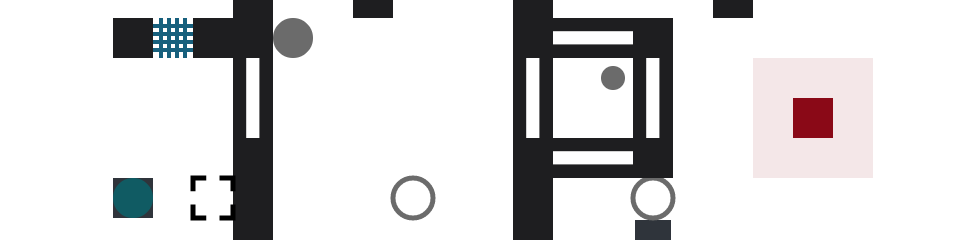
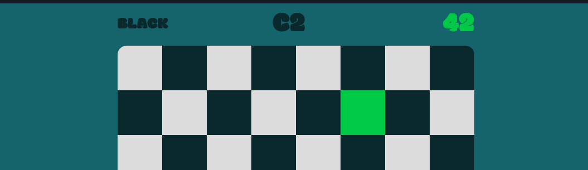
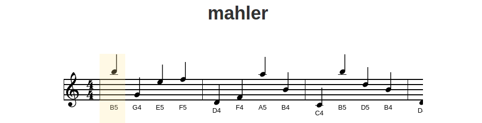

### Hi there 👋 

<!--
**cristiandima/cristiandima** is a ✨ _special_ ✨ repository because its `README.md` (this file) appears on your GitHub profile.

Here are some ideas to get you started:

- 🔭 I’m currently working on ...
- 🌱 I’m currently learning ...
- 👯 I’m looking to collaborate on ...
- 🤔 I’m looking for help with ...
- 💬 Ask me about ...
- 📫 How to reach me: ...
- 😄 Pronouns: ...
- ⚡ Fun fact: ...
-->

I'm Cristian. I like hard problems, software, finance, music of all kind, and ambitious open minded people. I'm passionate about artificial intelligence, natural language processing, financial markets, and web development.

#### Online properties

- :notebook_with_decorative_cover: I blog at http://cristiandima.com
- :video_game: [Box](https://cristiandima.github.io/box/) a 2d puzzle game inspired by The Talos Principle 
- :horse: [ChessBoardMaster](http://cristiandima.github.io/chessboardmaster/) 
- :musical_keyboard: [Mahler](http://cristiandima.github.io/mahler/) a sight reading app (some horrendoussly complicated js code that seems to still work many years later) 
